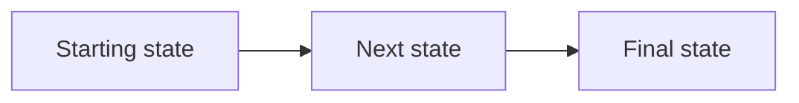

# <DESIGN_TITLE> — Plain English Walkthrough

A narrative tour of how this system works from the user's vantage point. Read this first; technical specs in 01-* through 0N-* are the second reference.

## What this feature does, in one paragraph

<Elevator pitch in plain English, no jargon, no function names. Service names OK.>

## The normal cycle

<Story of one happy-path execution end to end. Box 1 → Box 2 → Box 3 framing
 for orchestrated flows, or sequence-of-events framing for request-driven systems.
 Use real-world analogies where helpful.>

## What the user sees

<UI surfaces tour. What does the user touch? What do they see in response?>

## What can go wrong

**Soft failures (system keeps going).** <Recoverable errors and how they're handled.>

**Hard failures (system stops and alerts).** <Errors that page someone.>

## How we'll know it's working

<Observability in plain language — alarms, dashboards, signals to watch.>

## Lifecycle diagram

## TL;DR

1. <Bullet 1>
2. <Bullet 2>
3. <Bullet 3>
4. <Bullet 4>
5. <Bullet 5>
6. <Bullet 6>
