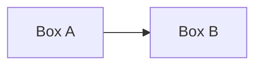
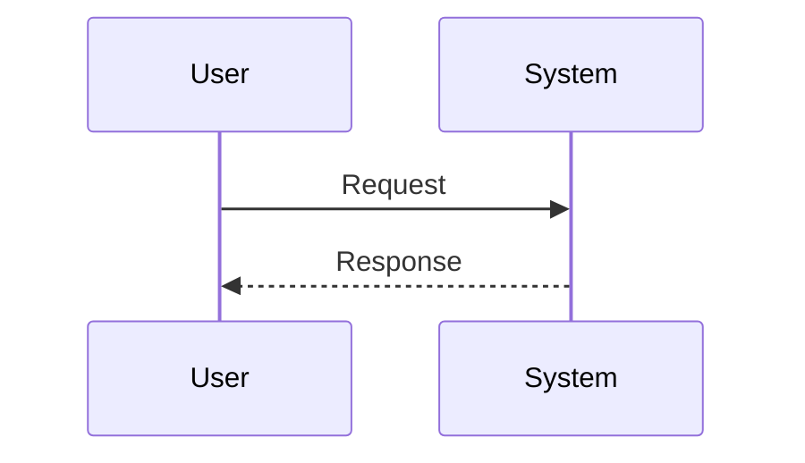

# Architecture Diagrams

Dense technical diagrams. Lighter narrative diagrams live in [[00a-plain-english]].

## <Diagram name 1>

<One-paragraph description of what the diagram shows and why it matters.>

## <Diagram name 2>

