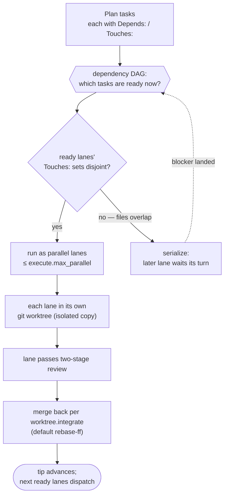

import { Aside } from '@astrojs/starlight/components';

When you run **[/c-execute](/cadence/execute/)**, it doesn't grind through your plan one task after another. It works out which tasks can safely run *at the same time* and runs them in parallel (in separate, isolated copies of your repo) then merges the results back together. This page explains how that works without you needing to manage any of it, and then introduces **[/c-worktree](/cadence/reference/c-worktree/)**: the same machinery, driven by hand, and the opinionated way to handle worktrees on Cadence.

## Step one: build a dependency map

Every task in a plan can declare what it depends on, via a `Depends:` line. Task 2.1 might say it depends on Task 1.1, because it can't start until that earlier work exists.

`/c-execute` reads all of those edges and builds a **dependency DAG**: a map of what must come before what. A task is *ready* the moment every task it depends on has landed. Everything that's ready and doesn't depend on each other can, in principle, run together.

## Step two: group ready work into lanes

The unit of parallel work is a **lane**. A lane is one **phase file**. Here "phase" correctly means a subdivision of the plan, the `01-…md`, `02-…md` files that break a big plan into chunks. Each ready phase file becomes one lane, run by one implementer agent.

<Aside type="note" title="One word, two meanings, and this is the right one">
Across Cadence, the six-step pipeline is made of **stages** (brainstorm, design, plan, execute, audit, validate). "Phase" is reserved for *plan subdivisions*: the numbered phase files inside a single plan. On this page, lanes map to those phase files, so "phase" is being used in its correct, narrow sense.
</Aside>

## Step three: the touches-conflict guard

Running things in parallel is only safe if they don't step on each other. Each task declares a `Touches:` list: the files it will modify. The scheduler enforces a hard rule:

> Two lanes run concurrently **only if their `Touches:` file sets are disjoint** (no file in common).

If two ready lanes both want to touch the same file, they don't run together. The later one waits until the first has landed and merged. This **touches-conflict guard** is never overridden and never auto-resolved. If the file sets overlap, the lanes are serialized, full stop. (A conflict that slips through means a `Touches:` list was wrong, and `/c-execute` stops and tells you rather than guessing.)

## Step four: each lane gets its own worktree

A lane doesn't run in your main checkout. It runs in its own **git worktree**: a separate working directory on its own branch, created from the current tip of your work. Worktrees live under `.cadence/worktrees/` and are created and removed automatically.

This is what makes true parallelism safe: each lane has a private copy of the repo, so concurrent lanes can't clobber each other's files mid-flight. The combination of *separate worktrees* plus the *touches-conflict guard* is the belt-and-suspenders that lets multiple agents work at once without corrupting the result.

<Aside type="tip" title="You confirm once, then it's automatic">
Before opening the first worktree, `/c-execute` shows you the plan and asks once for the go-ahead. After you confirm, worktree creation, merging, and cleanup are fully automatic, with no per-lane prompts. The completion gate even refuses to finish if any stray worktree is left behind.
</Aside>

Putting the four steps together: the plan's tasks become a dependency map, the ready ones pass the touches-conflict guard, the survivors run as parallel lanes in their own worktrees, and each lane merges back to advance the tip:

## How many at once, and how they merge

- **Cap.** At most `execute.max_parallel` lanes run concurrently (default **4**). If more work is ready than slots are free, the extra lanes wait their turn.
- **Merge.** When a lane finishes and passes review, it's integrated per `worktree.integrate`. The default is **`rebase-ff`**: the lane's branch is rebased onto the current tip and fast-forwarded in, keeping a clean linear history with each task's commits preserved. Repos that forbid history rewriting can set `merge-commit` instead.

A single phase file can even become two or three lanes over a run: if only part of it is ready now, the ready part dispatches immediately and the rest forms a follow-up lane once its blockers clear.

<Aside type="caution" title="Opting out">
Set `execute.parallel: false` in your config and `/c-execute` runs everything sequentially with no worktrees at all. Older plans that predate the `Touches:` format also fall back to sequential automatically.
</Aside>

## The same machinery, driven by hand: /c-worktree

Lanes aren't the only thing that uses this machinery. The **[/c-worktree](/cadence/reference/c-worktree/)** utility command is the **opinionated way to handle worktrees on Cadence**: the same isolation, the same config, the same merge safety, but driven interactively by you instead of automatically by the scheduler.

Reach for it whenever you want isolated feature work in its own working directory: a side experiment, a second Claude Code session working the same repo in parallel, or any branch you'd rather not develop in your main checkout. It needs no design, no plan, and no other `/c-*` command. The lifecycle is three subcommands:

- **`/c-worktree create`** cuts a new worktree under the shared `worktree.dir` (default `.cadence/worktrees/`, the same directory the lanes use). It asks which base branch to cut from, never assumes, and records the answer so the merge later knows where the work goes home. If your config defines hooks, it can also provision the copy and start a dev server on its own dedicated port.
- **`/c-worktree merge`** integrates the branch back into its recorded parent, per the same `worktree.integrate` policy the lanes follow, under the same shared merge lock. All the interaction (what will move, which merge type) happens *before* the lock, so the lock is held only for the git operations themselves.
- **`/c-worktree cleanup`** stops the dev server, removes the worktree, deletes the branch, and releases the port.

The payoff of one opinionated model instead of ad-hoc `git worktree` commands: every worktree in the repo, whether you made it or a lane did, lives in the same place, merges by the same policy, and respects the same lock. Because `/c-worktree` and `/c-execute` share the merge lock (`worktree.merge_lock`, on by default), a hand-driven merge and an automatic lane landing can never collide; whichever asks second simply waits its turn.

<Aside type="tip" title="Works in any git repo">
`/c-worktree` is generic and standalone: with no `worktree:` config at all it still runs the full create / merge / cleanup lifecycle. Config hooks layer on the repo-specific parts (provisioning, a dev port, a dev server, a deploy guard) without changing the core model.
</Aside>

## Reference

- Full command behavior: **[/c-execute reference](/cadence/reference/c-execute/)** and **[/c-worktree reference](/cadence/reference/c-worktree/)**.
- The `execute.*` lane settings (`max_parallel`, `parallel`, `worktree_confirm`): **[Configuration reference](/cadence/reference/config/)**.
- The shared `worktree.*` settings (`dir`, `integrate`, `merge_lock`, `lock_stale_threshold`, the `hooks.*` map): **[Configuration reference](/cadence/reference/config/#worktree)**.
