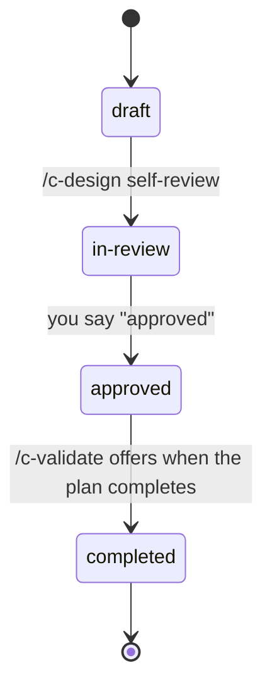
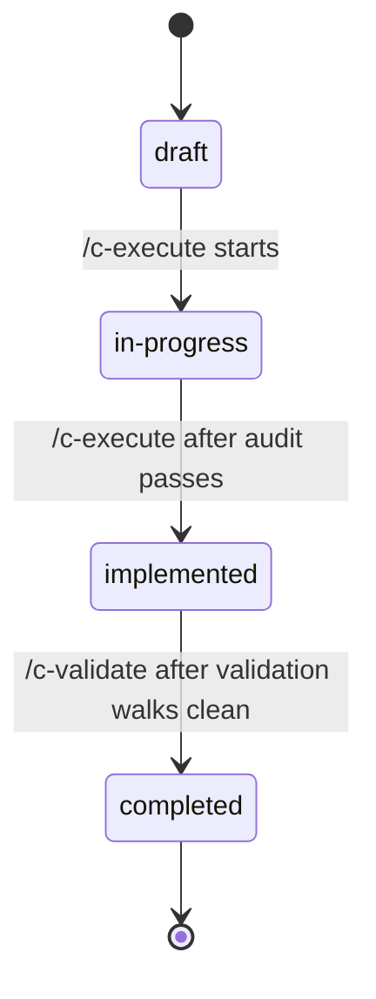

import { Aside } from '@astrojs/starlight/components';

Every design and every plan carries a `status` in its frontmatter. The status is the single, honest answer to "where is this work right now?", and each move from one status to the next has a clear trigger: either a Cadence stage, or you. Nothing changes status by accident.

## Designs

A design moves through four working statuses on its way to done:

- **draft → in-review**: triggered by **[/c-design](/cadence/design/)** after it finishes its own self-review pass. The design is written and internally checked; now it's ready for *your* eyes.
- **in-review → approved**: triggered by **you**. This is a human gate: the design sits in review until you explicitly say "approved." Nothing downstream (no plan, no code) proceeds until you do.
- **approved → completed**: offered by **[/c-validate](/cadence/validate/)** once the plan built from this design reaches `completed`. Cadence offers it; you confirm.

<Aside type="note" title="Approval is yours alone">
The jump to `approved` is the one transition no Cadence stage will ever make for you. It's the design gate: the place where your judgment, not the machine's, decides the work is right.
</Aside>

## Plans

A plan moves through its own four statuses as it gets built and verified:

- **draft → in-progress**: triggered when **[/c-execute](/cadence/execute/)** starts running the plan.
- **in-progress → implemented**: triggered by **[/c-execute](/cadence/execute/)**, but only after the completion **audit passes**. The code is written *and* checked against its own plan before the plan is called implemented.
- **implemented → completed**: triggered by **[/c-validate](/cadence/validate/)** once it walks the plan's validation checklist and everything passes clean (after you've deployed).

<Aside type="tip" title="Status is the trust trail">
Read top to bottom, the statuses are the chain that lets you trust a result you didn't read line-by-line: a design you *approved*, a plan that *passed audit*, and an implementation that *validated clean*. Each word is a gate that something, or someone, had to clear.
</Aside>

## The two lifecycles connect at the end

The lifecycles aren't independent. When a plan reaches `completed`, `/c-validate` reads the design it was linked to and offers to flip *that* design to `completed` as well, closing the loop on the whole piece of work, design and plan together. You confirm that final step.

There are also two parking statuses, `superseded` and `on-hold`, for work that's been replaced or paused. They aren't part of the normal forward flow.

## Reference

- The stages that drive these transitions: **[/c-design](/cadence/reference/c-design/)**, **[/c-execute](/cadence/reference/c-execute/)**, **[/c-audit](/cadence/reference/c-audit/)**, and **[/c-validate](/cadence/reference/c-validate/)**.
