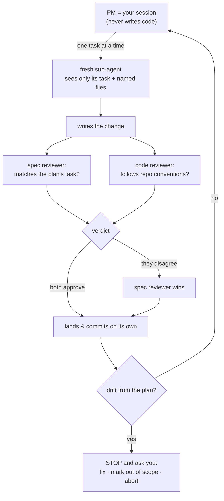

import { Aside } from '@astrojs/starlight/components';
import Quiz from '../../components/Quiz.astro';

Execute is the stage that most needs to earn your trust: it's where the plan becomes actual code. And it's built specifically so you can trust the result *without reading the diff* (the line-by-line list of code changes). If you read one deep dive closely, make it this one.

## The PM-and-sub-agent model

When you run `/c-execute`, your own session becomes the **PM**, the project manager. The PM doesn't write code and never reads the whole repository. Instead, for each task in the plan, it dispatches a **fresh sub-agent**: a worker that sees only that one task and the specific files it needs.

<Aside type="note" title="Why fresh workers per task">
Each worker starts clean, with just its task and the files named in that task. It can't be confused by context from earlier work, and it physically can't wander off and change unrelated parts of the codebase. The PM coordinates; the workers do focused, bounded work.
</Aside>

## Parallel lanes and the touches-conflict guard

The PM reads the plan's dependency information and runs independent work in parallel **lanes**: each phase file becomes a lane running in its own isolated workspace. To keep two parallel lanes from colliding, Cadence uses a **touches-conflict guard**: every task declares exactly which files it writes, and two lanes are allowed to run at the same time only if they touch entirely different files. If they'd overlap, the later one simply waits its turn. It never tries to merge two simultaneous edits to the same file.

## Two-stage review: spec, then code

No change lands until it passes **two reviewers**, run at the same time:

1. A **spec reviewer** asks: does this change do exactly what the plan's task asked for, with nothing missing and nothing extra?
2. A **code reviewer** asks: does this change follow the repository's existing conventions?

If the two disagree, **the spec reviewer wins**: matching the plan is what matters most, and a style preference never overrides correctness against the spec. Only when both approve does the change land.

<Aside type="tip" title="This is why you don't read the diff">
You don't verify the code by reading it. Two independent reviewers verify it for you, against the plan you already approved. That's the gate. Your job is to read their plain-English summary of what landed.
</Aside>

## The three drift response paths

If a change starts to drift from the plan (the work doesn't fit, the spec is ambiguous, something contradicts the design), Cadence **stops** and surfaces the problem to you with three choices:

- **Fix**: adjust the task or expand it in place, then continue.
- **Mark out of scope**: explicitly record that this won't be done now, with a reason.
- **Abort**: pause the whole run; pick it up later from exactly where it stopped.

It never silently picks one. The decision is always yours.

The whole loop, from the PM dispatching a task to the change landing (or stopping for you on drift):

<Aside type="caution" title="What execute never does">
It never auto-deploys your code. It never rewrites history by amending commits. And it never skips the repository's safety checks. If a check fails, it fixes the cause and makes a new commit. It doesn't paper over the failure.
</Aside>

<Quiz
  question="If the spec reviewer and the code reviewer disagree, which one wins?"
  options={[
    "The spec reviewer: matching the plan outranks a style preference",
    "The code reviewer: conventions always win",
    "Neither: the change is rejected outright",
    "The PM decides at random"
  ]}
  answer={0}
  explanation="Spec wins on conflict. The plan is the contract you approved; a code-convention finding never overturns a change that correctly matches the spec."
/>

**Exact usage:** see the **[/c-execute reference](/cadence/reference/c-execute/)** for invocation, pre-flight checks, and resume behavior.

Next stage: **[The Audit stage](/cadence/audit/)**.
