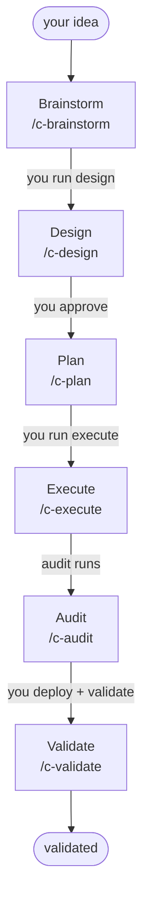

import { Aside } from '@astrojs/starlight/components';
import Quiz from '../../../components/Quiz.astro';

Cadence is a Claude Code plugin that turns "I want to build X" into working, validated software, without asking you to read a single line of code to know it's right. This first lesson gives you the mental model. The next one installs the plugin.

## Why the mental model comes first

Cadence is built for an **AI-first** way of working. When the AI writes the code, the bottleneck moves: the scarce, valuable work is no longer typing, it's **brainstorming and refining intent** (deciding what to build and why, precisely enough that the machine can carry it out). Cadence is a workflow built for that age. You stay in flow at the level of intent, and Cadence makes sure the intent actually gets met.

That only works if you can trust the result without reading the code. Cadence earns that trust *structurally*, not by asking you to inspect diffs:

> Work moves through six visible **stages**. Each stage produces something you can **read**. Nothing advances to the next stage until you approve it at the **gate** in between.

You direct and approve in plain English. The later stages (audit and validate) do the line-by-line checking you're never going to do yourself. So the mental model (stages → artifacts → gates) comes before the install steps, because it *is* what you're installing.

<Aside type="note" title="Jargon, glossed once">
A few words you'll see as you go, in plain English:
- **Stage**: one named step of the pipeline (brainstorm, design, plan, execute, audit, validate).
- **Artifact**: the thing a stage hands you, a folder, a document, a commit you can open and read.
- **Gate**: the explicit pause between two stages where you approve before anything continues.
- **Drift**: when the work quietly stops matching what you agreed to. Cadence's whole job is to make drift impossible to do silently.
</Aside>

## The six-stage pipeline

Cadence runs your idea through six core stages, in order. Each one has a slash command and produces an artifact you can read:

1. **Brainstorm** (`/c-brainstorm`): one question at a time turns a fuzzy idea into a short written stub.
2. **Design** (`/c-design`): the stub becomes a full, plain-English design folder.
3. **Plan** (`/c-plan`): the approved design becomes an exact, step-by-step plan written for the machine to follow.
4. **Execute** (`/c-execute`): the plan becomes real code, reviewed twice before it lands.
5. **Audit** (`/c-audit`): an independent check proves the code matches the plan.
6. **Validate** (`/c-validate`): a post-deploy walkthrough confirms the live thing actually works, then marks the work done.

There are also three **diagnostic** commands you can run any time, off to the side of the pipeline: `/c-check`, `/c-find-bugs`, and `/c-explain`. That's nine commands in the pipeline and diagnostic set. You meet the diagnostics in the last deep dive. The plugin also installs one **utility** command that sits outside the pipeline entirely: `/c-worktree`, for driving isolated git worktrees by hand.

The whole pipeline, with the gate on each arrow (the thing *you* do to let the work advance):

<Aside type="tip" title="The through-line">
You never have to trust the code by reading it. You trust the **gate**: the explicit, human-approved pause between every stage. That's what makes Cadence usable by someone who can't (or won't) read diffs.
</Aside>

<Quiz
  question="What does each of Cadence's six stages produce?"
  options={[
    "An artifact you can read: a folder, a document, or a commit",
    "A diff you have to review line by line",
    "Nothing visible until the very end",
    "A test report only"
  ]}
  answer={0}
  explanation="Every stage hands you a tangible artifact. You evaluate the artifact at the gate; you never have to read the code itself."
/>

Next: **[Install Cadence](/cadence/get-started/02-install/)**. Get the plugin running in Claude Code.
